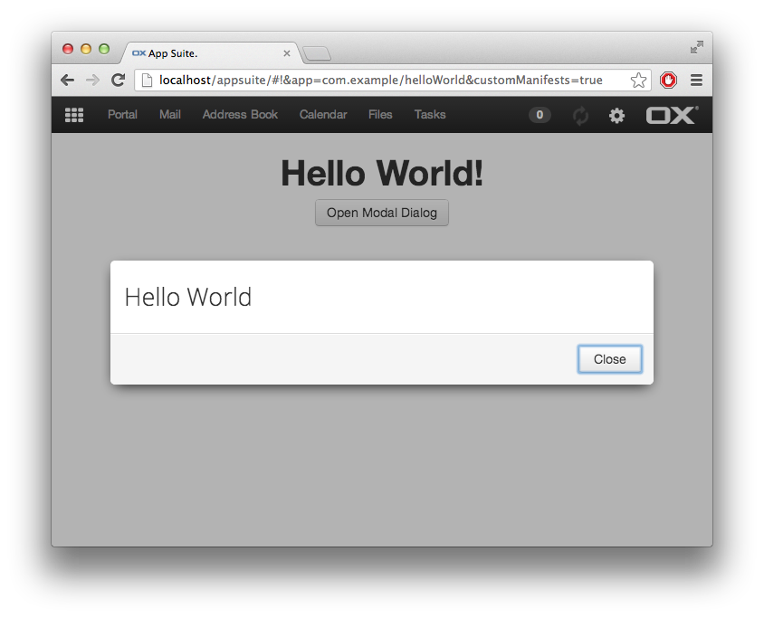
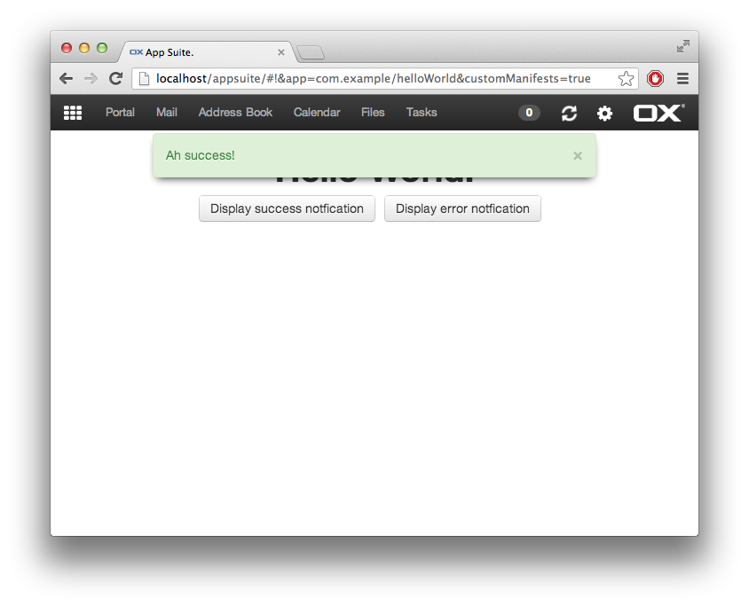
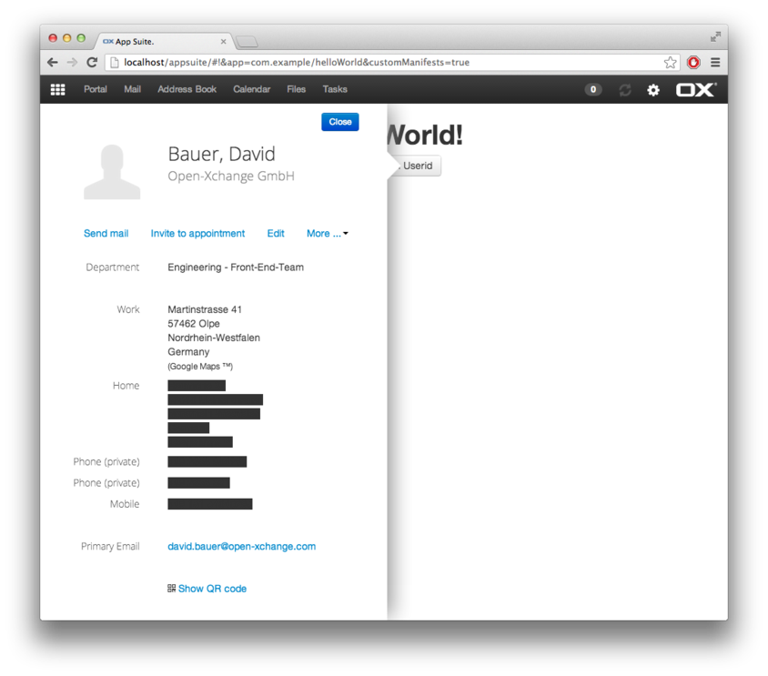

# Getting Started

First create a new folder helloWorld in your namespace in the app folder, in this example the namespace com.example will be used. (`apps/com.example/helloWorld`)

For starters we need three files: a manifest File `manifest.json`, the main application file, and an entry point plugin registering the application within App Suite.
It is convention to name your main application file `main.js` and the intrypoint file `register.js`.

## Manifest

First create a `manifest.json` file to register your plugin.

```JSON
{
    "namespace": "core"
}
```

You can find more detailed information on manifests here: [UI manifests explained]({{ site.baseurl }}/ui/customize/manifests.html).

## Main application file

This is the base skeleton of a new app with a window, that displays "Hello World".
Please read the annotated source code of an example main.js below, it is quite self-explanatory.

```javascript
define('com.example/helloWorld/main', [], function () {

    'use strict';

    // this is just code. loading this does not imply to launch the application

    // application object. 'name' is mandatory!
    var app = ox.ui.createApp({ name: 'com.example/helloWorld' });

    // by using setLauncher this way, we register a callback function
    // that is called when the application is really launched
    app.setLauncher(function () {

        // application window (some applications don't have a window)
        var win = ox.ui.createWindow({
            name: 'com.example/helloWorld',
            title: 'Hello World'
        });

        app.setWindow(win);

        // Add css class with your namespace
        win.addClass('com-example-helloWorld');

        // add something on 'main' node
        win.nodes.main
            .css({ padding: '13px', textAlign: 'center' })
            .append($('<h1>').text('Hello World!'));

        // show the window
        win.show();
    });

    return {
        getApp: app.getInstance
    };
});
```

Save this file, build and refresh your browser, go to "Your applications", where you should find your app with your app icon.
Hint: You can also launch the application manually via your browsers console:

```javascript
ox.launch('com.example/helloWorld/main');
```


## Register the app

To make App Suite aware of a new app, it needs to be registered by a plugin.

As a blueprint, this snippet can be used:

```javascript
define('com.example/helloWorld/register', [
    'io.ox/core/extPatterns/stage',
    'io.ox/core/desktop'
], function (Stage, ui) {
    'use strict';

    new Stage('io.ox/core/stages', {
        id: 'com.example/helloWorld',
        // register before all core apps get registered
        before: 'app_register',
        run: function () {
            var app = ui.createApp({
                // a name is mandatory, it should be the path fo the main.js file
                name: 'com.example/helloWorld',
                // just a title for the app
                title: 'Hello World',
                // this app allows for deep links
                refreshable: true,
                // do not register settings
                settings: false,
                // this will be injected into DOM as is
                icon: '<i class="fa fa-globe">'
            });
            ui.apps.add(app);
        }
    });
});
```

### Adding the app to the launcher

In order to add the app to the launcher, it also needs to be defined in the middleware configuration.
The key is `io.ox/core//apps/list` and contains a comma separated list of app ids.
If not specified, the id will be the same as the `name` attribute.

For development purposes (if you don't have access to the middleware configuration), it is possible to manually set the list in the browser console.

```javascript
_.pluck(ox.ui.apps.forLauncher(),'id').join(',')
// "io.ox/mail,io.ox/calendar,io.ox/contacts,io.ox/files,io.ox/portal,io.ox/tasks"
require('settings!io.ox/core').set('apps/list', 'io.ox/mail,io.ox/calendar,io.ox/contacts,io.ox/files,io.ox/portal,io.ox/tasks,com.example/helloWorld').save();
```

Refresh the browser to activate the changes.

### Setting an app icon

The `icon` attribute can be used to define an icon for the app.
The valua is injected directly into the DOM, so this can be an img tag, inline SVG code, or as in this example a font-awesome icon.

# Advaned topics

This section should help to implement some advanced use cases.

## Styles

In order to prevent conflicts with other apps or base-styles you should add a css class with your namespace to the main node of your application.

```javascript
win.addClass('com-example-helloWorld');
```

It is convention to create a file called style.less in the root folder of your application. This file has to be defined for [require.js](http://requirejs.org/docs/api.html) which is done like this.

```javascript
define('com.example/helloWorld/main',
    ['less!com.example/helloWorld/style.less'
    ], function () {
    //...
})
```

A simple less file would look like this:

```less
.com-example-helloWorld {
    h1 {
        color: red;
    }
}
```


## Internationalization (i18n)

In order to get gettext support for your app you have to require it:

```javascript
define('com.example/helloWorld/main',
    ['gettext!com.example/helloWorld'
    ], function (gt) {
    //...
})
```

Every string in your app should be processed by gettext in order to have them properly translated.
In our example it would look like this:

```javascript
//...
    .append($('<h1>').text(gt('Hello World!')));
//...
```

You can find more detailed information on this topic [here]({{ site.baseurl }}/ui/how-to/i18n.html).

## Making an application window chromeless

If you don't have the need for a toolbar and want a chromeless window, you can it in the ox.ui.createWindow function call.

```javascript
var win = ox.ui.createWindow({
    //...
    chromeless: true
    //...
});
```

## Creating a Dialog

In order to open a dialog `io.ox/core/tk/dialogs` has to be required and use one of the supplied methods.

```javascript
win.nodes.main
    .append($('<a class="btn">').text('Open Modal Dialog')
        .on('click', function (e) {
            e.preventDefault();
            require(['io.ox/core/tk/dialogs'],
                function (dialogs) {
                    new dialogs.ModalDialog({
                        width: 600,
                        easyOut: true
                    })
                    .append($('<p>').text('Hello world'))
                    .addButton('close', 'Close')
                    .show();
                }
            );
        })
    );
```



## Displaying a notification

If you want to display notifications you can require `io.ox/core/notifications` and use the yell method, like in the examples below.

```javascript
require(['io.ox/core/notifications'], function (notifications) {
    win.nodes.main.append(
        $('<a class="btn">').text('Display success notfication')
            .on('click', function () {
                notifications.yell('success', 'Ah success!');
            }),
        $('<a class="btn">').text('Display error notfication')
            .on('click', function () {
                notifications.yell('error', 'Oh failed!');
            })
    );
});
```



You can find information about more advanced notifications [here]({{ site.baseurl }}/ui/customize/notifications.html).

## Displaying a Halo View

### Internal users

```javascript
win.nodes.main.append(
    $('<a href="#" class="btn halo-link">')
    .data({ internal_userid: ox.user_id })
    .text('Open Halo')
);
```

### External users

```javascript
win.nodes.main.append(
    $('<a class="btn halo-link">')
    .data({ email1: 'test@example.com' })
    .text('Open Halo from Email')
);
```



# Integrate settings

To get or set settings you have to create a settings subfolder, with a _defaults.js_ in which the default values are defined for your settings and a _model.js_.
Below you will find a simple example of these files.

## Defaults

```javascript
define('com.example/helloWorld/settings/defaults', [], function () {

    'use strict';

    // define the default values for your settings here
    var settingsDefaults = {
        exampleSetting: false
    };

    return settingsDefaults;
});
```

## Model

```javascript
define('com.example/helloWorld/settings/model', [
    'settings!com.example/helloWorld'
], function (settings) {
    'use strict';

    // Very simple default model
    var helloWorldModel = Backbone.Model.extend({


        initialize: function () {

        },

        save: function () {
            settings.save(this.attributes);
        },

        destroy: function () {

        }

    });

    return helloWorldModel;
});
```

## Get/Set

```javascript
require([
    'settings!com.example/helloWorld'
], function (settings) {
    win.nodes.main.append(
        $('<label>').text(gt('Example Setting')).append(
            $('<input type="checkbox">')
                .prop('checked', settings.get('exampleSetting', false))
                .on('change', function () {
                    settings.set('exampleSetting', $(this).prop('checked')).save();
                })
        )
    );
});
```

Try to click the checkbox and refresh the page, you will see, the setting being persisted with the jslob service.

# Additional information

Some additional information can be found at the following resources.

## Access full example

A git repository containing a full working version created in this guide can be found in the [Hello World - Simple application](https://gitlab.open-xchange.com/frontend/examples/simple-application/) repository.

## How to tackle problems

You got stuck with a problem while developing?
The documentation might help you out with the article about [debugging the UI]({{ site.baseurl }}/ui/miscellaneous/debugging.html).
