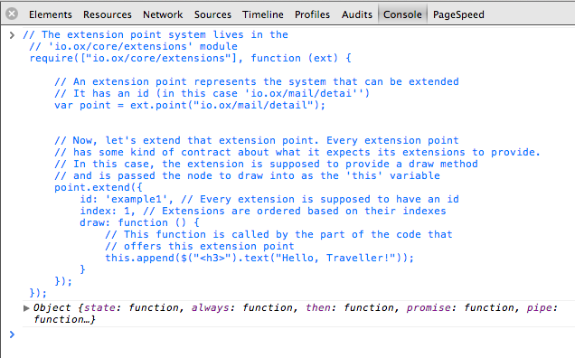
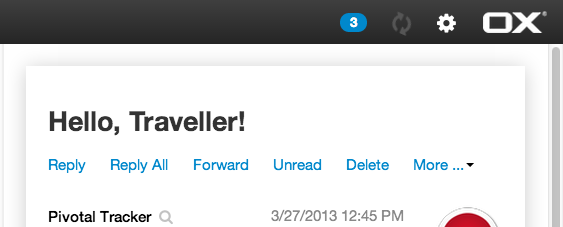
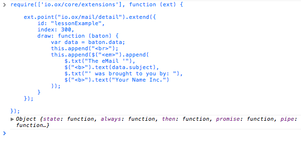
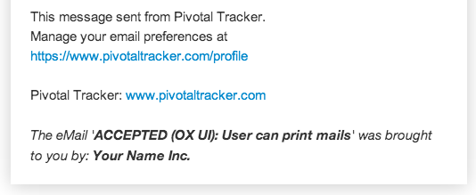

Abstractly speaking extension points are an architecture for letting plugins contribute functionality to other parts of the program.
They form the core of the OX App Suite plugin architecture.
This is a hands-on introduction based on simple code examples.
For more details take a look at Extending the UI.

# Extending the UI

In case you want try code by your own please follow these steps:

- get a appropriate browser to execute custom javascript during runtime (for example chrome with it's developer tools)
- login on OX App Suite
- copy code from beyond to you console and execute
- perhaps it could be necessary to switch app or reload the page

## Your first extension

Let's start with some example code.

```javascript
 // The extension point system lives in the
 // 'io.ox/core/extensions' module
 require(["io.ox/core/extensions"], function (ext) {

     // An extension point represents the system that can be extended
     // It has an id (in this case 'io.ox/mail/detail')
     var point = ext.point("io.ox/mail/detail");

     // Now, let's extend that extension point. Every extension point
     // has some kind of contract about what it expects its extensions to provide.
     // In this case, the extension is supposed to provide a draw method
     // and is passed the node to draw into as the 'this' variable
     point.extend({
         id: 'example1', // Every extension is supposed to have an id
         index: 1, // Extensions are ordered based on their indexes
         draw: function () {
             // This function is called by the part of the code that
             // offers this extension point
             this.append($("<h3>").text("Hello, Traveller!"));
         }
     });
 });
```

Please have a look at the detail view of a mail now.
Perhaps you have to select another mail to see the difference.

_step 1: default mail detail_


_step 2: execute code in chrome dev tools console_



_step 3: extended mail detail_



## A qualified mail footer

Let's try and add a section to the mails detail view and use some data of the currently viewed mail.
For information about the baton object please take a look at the more detailed article how to extend the UI.

```javascript
require(['io.ox/core/extensions'], function (ext) {
    ext.point("io.ox/mail/detail").extend({
        id: "lessonExample",
        index: 300,
        draw: function (baton) {
            var data = baton.data;
            this.append("<br>");
            this.append($("<em>").append(
                $.txt("The eMail '"),
                $("<b>").text(data.subject),
                $.txt("' was brought to you by: "),
                $("<b>").text("Your Name Inc.")
            ));
        }
    });
});
```

Again: When navigating back to the email view you might have to select another mail to make this change visible.

_step 1: default mail detail_


_step 2: execute code in chrome dev tools console_



_step 3: mail detail with disabled inline links_



After switching to the mail app again, you might have to select another mail to once again run through the rendering process that calls on the extensions.
As you can see in the example above, the code calling the extension passes along the eMail in the data attribute of the baton parameter.
The _index_ of the extension means that it is rendered after the mail body, who's extensions index is **300**.
Currently (until we have more comprehensive documentation) you can only find the indexes (and the way an extension is supposed to behave) by reading our code.
Reload the page (to clear out the registered extensions) and try switching the index to **190** and see where the added sentence shows up now.

# Customizing the UI

Since extensions are a property of the runtime system, you can also modify them.
The extension system offers a couple of things you can do with existing extensions like **changing their order, disabling them or replacing them**.
Let's look at how to accomplish all of these, again by modifying the mail detail view.

## switch off inline links

```javascript
require(["io.ox/core/extensions"], function (ext) {
    // Here the id of the extension comes into play again.
    // If you look at the code of the mail detail view (in io.ox/mail/view-detail)
    // You can see the extension registers itself with the id 'inline-links'
    // So that is the argument we pass to disable
    ext.point("io.ox/mail/detail").disable('inline-links');
});
```

Again: When navigating back to the email view you might have to select another mail to make this change visible.

_step 1: default mail detail_


_step 2: execute code in chrome dev tools console_


_step 3: mail detail with disabled inline links_


## change order

And now let's switch the order around:

```javascript
require(["io.ox/core/extensions"], function (ext) {
    // From the extension point 'io.ox/mail/detail' get the extension with
    // the id 'subject' (which is passed to the callback)
    ext.point("io.ox/mail/detail/header").get("subject", function (extension) {
        // Put it last
        extension.index = 300;
    });
});
```

_step 1: default mail detail_


_step 2: execute code in chrome dev tools console_


_step 3: pushed subject to header bottom_


# Trouble finding the right extension point?

You don't know where to append your plugin's content / which extension point you should use?
A good way to find the suitable extension point, is to search in the OX Source Code for an HTML-element displayed in the user interface.
For example an easy to identify text.
Once found the HTML-element in the source, you can see which extension point was used appending this element to the UI and append your content there aswell.
